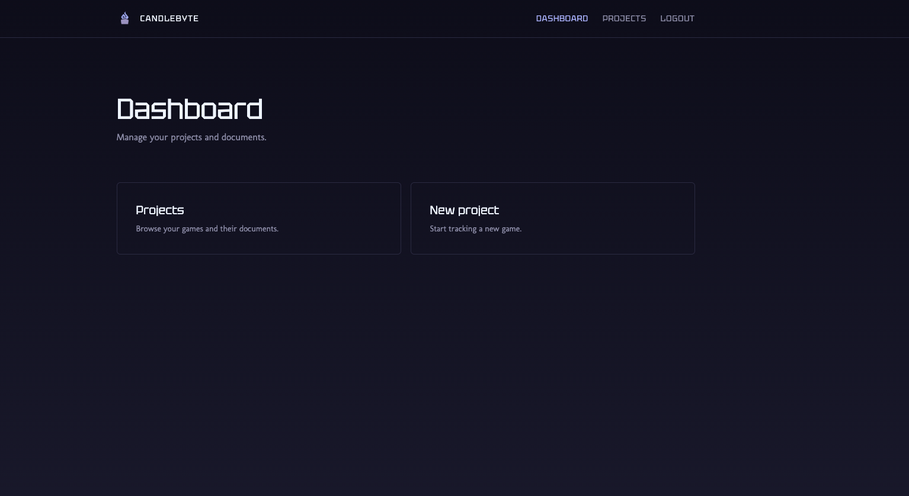
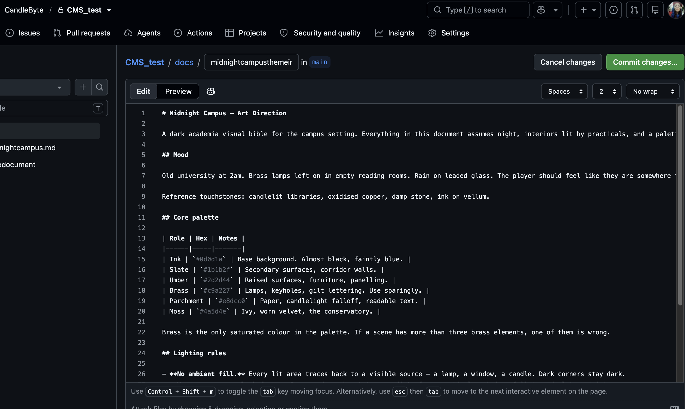
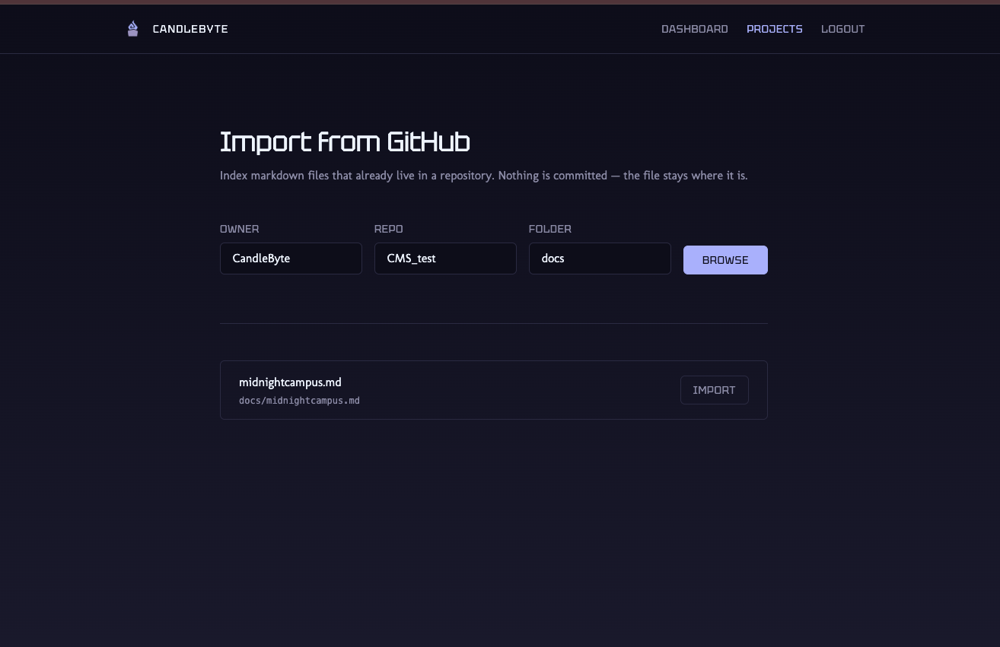
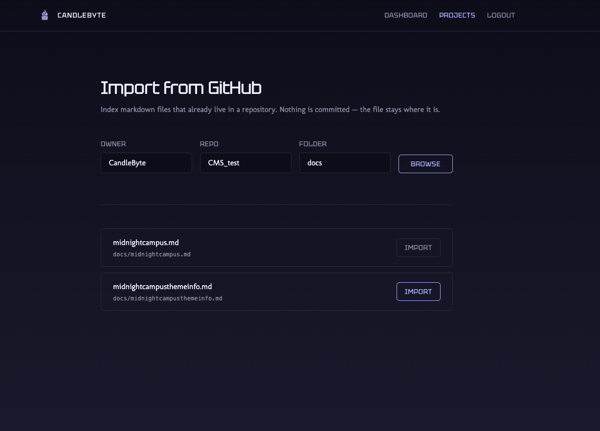
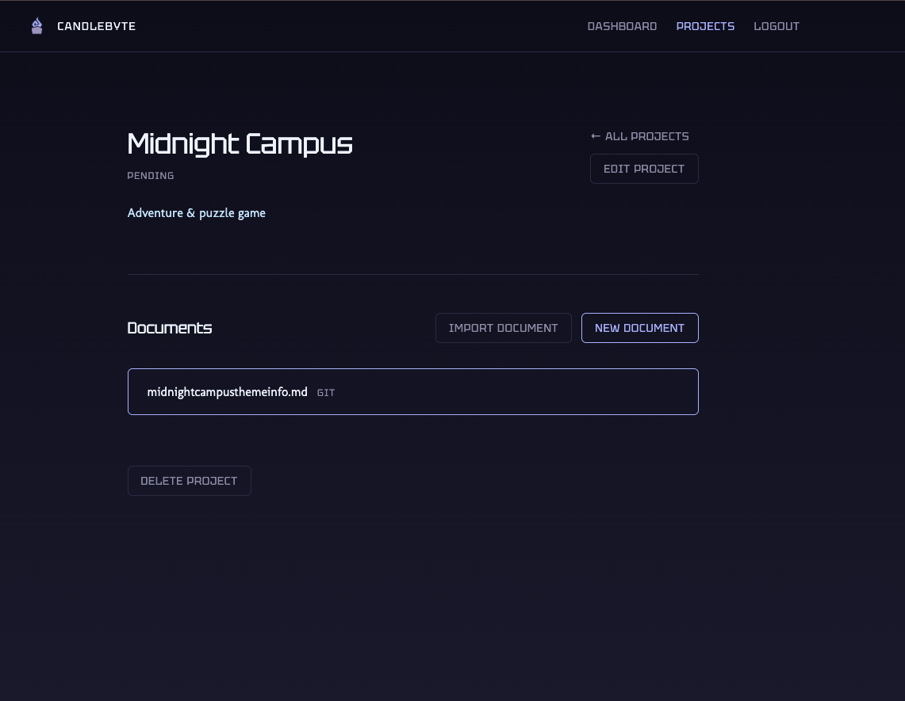
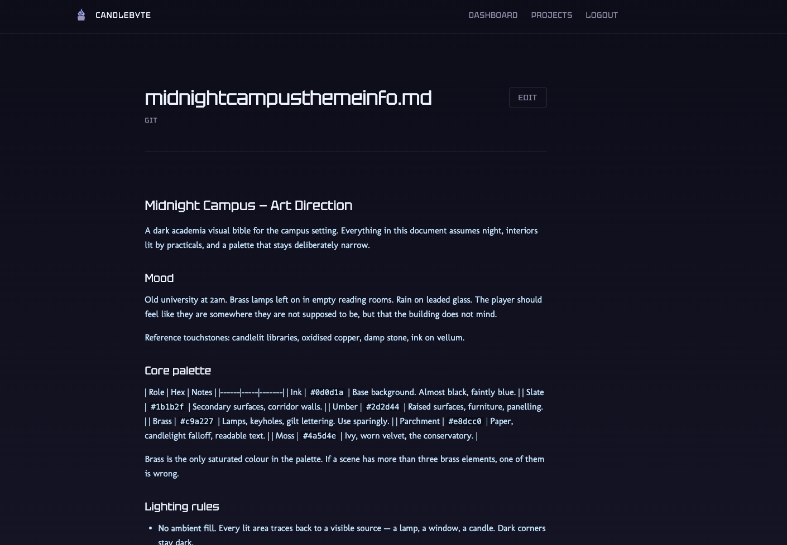
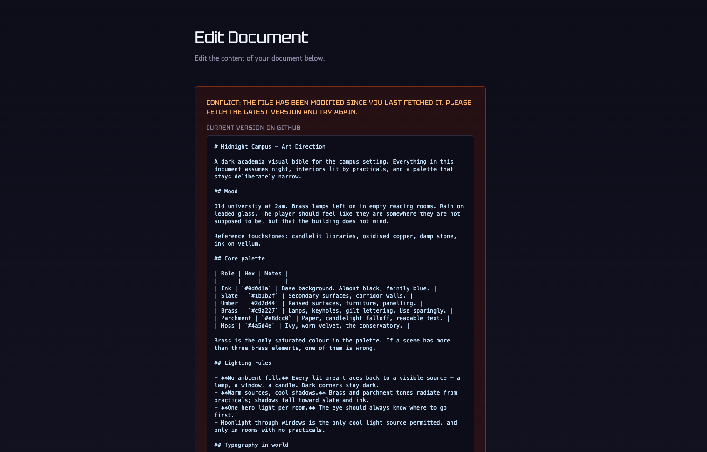
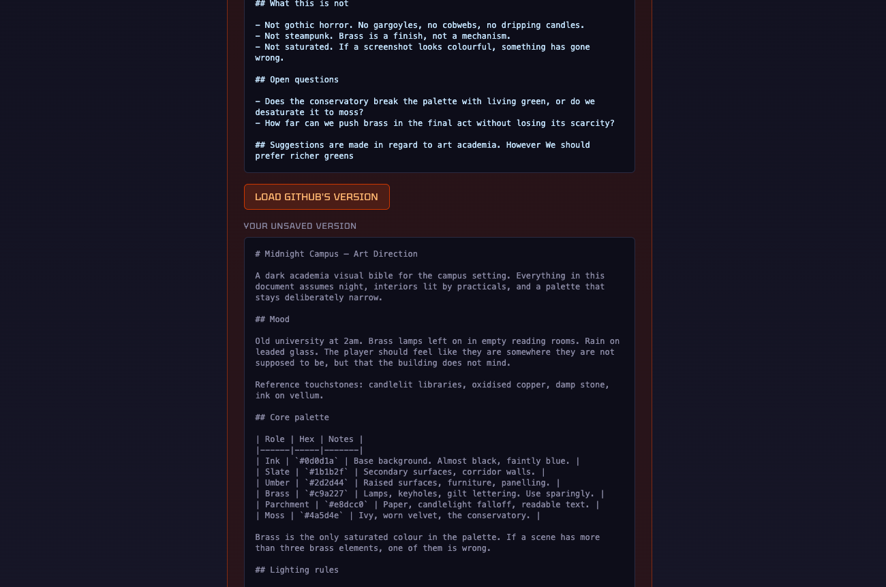
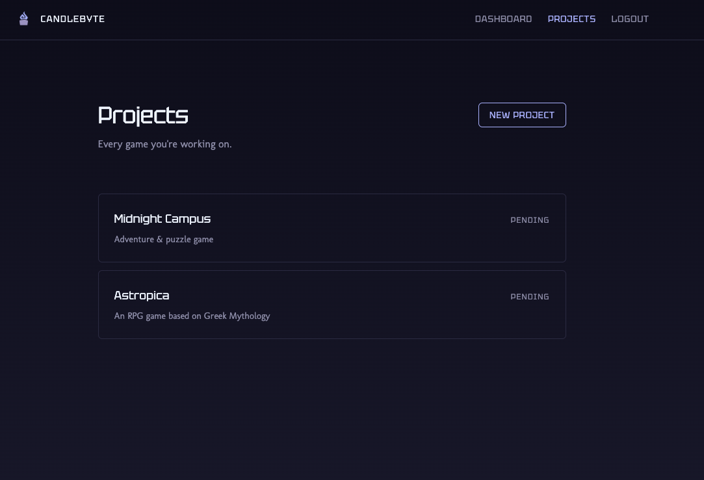
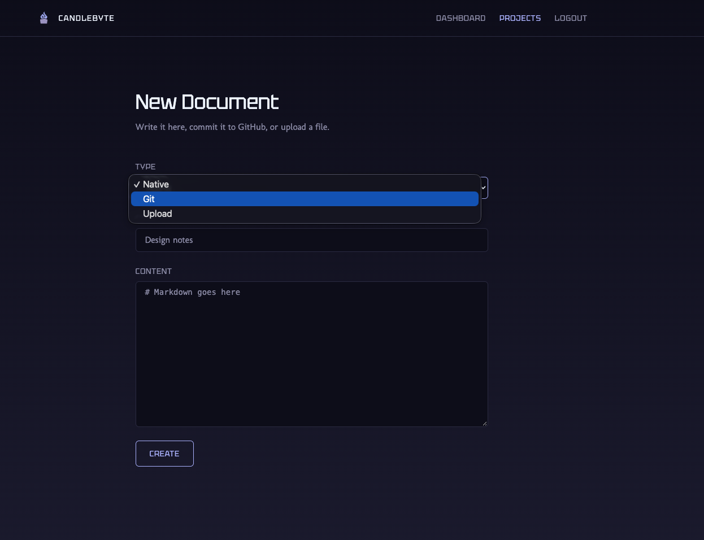

# CandleByte CMS

A content management system for a small game development studio. It solves one specific problem: a team whose documentation lives scattered across Obsidian vaults, GitHub repos, and shared drives, with no single place to find anything.

The core idea is **hybrid document storage**. Rather than forcing everyone into one tool, the CMS indexes documents wherever they already live — and writes back to them.



---

## The problem it solves

One team member writes everything in Obsidian and commits markdown to git. Others want to upload artwork and PDFs. Some things are easier to write directly in a browser. Previously that meant three separate places to look, and a new game project meant a new vault *and* a new repo.

The CMS keeps one browsable surface across all three, without asking anyone to change how they work.

---

## Document kinds

Every document belongs to a project and declares a `kind`. The kind determines where the truth lives:

| Kind | Source of truth | What Mongo stores |
|------|----------------|-------------------|
| `native` | MongoDB | the markdown itself |
| `git` | **A GitHub repo** | repo, branch, path, and the file's current **sha** |
| `upload` | **Cloudflare R2** | the object key, mime type, size |

For `git` documents, MongoDB is an *index*, not a store. The canonical file is the one in the repo — so the teammate who writes in Obsidian and commits normally never has to touch the dashboard, and his work still shows up in it.

Files that already exist in a repo can be **imported**: the CMS lists a repo's markdown, and importing one creates an index record pointing at it. Nothing is committed and nothing moves — an existing Obsidian vault can be surfaced in the dashboard without changing how anyone works.











---

## The interesting part: writing to GitHub safely

Reading from GitHub is easy. Writing is where it gets interesting, because two people can edit the same file at once.

GitHub's Contents API uses **optimistic concurrency**. Every file has a `sha` — a fingerprint of its current content. To update a file you send the new content *plus the sha you believe is current*. GitHub accepts the write only if that sha still matches.

The lifecycle:

1. **Create** — the dashboard commits a new file. GitHub returns a sha, which is stored on the Document record.
2. **Read** — every read fetches fresh from GitHub and refreshes the stored sha, so the editor always starts from the current version.
3. **Update** — the dashboard sends the new content with the stored sha. If it still matches, GitHub commits and returns a new sha, which replaces the old one.
4. **Conflict** — if someone committed in between, the stored sha is stale. **GitHub rejects the write with a 409**, and that rejection is a feature: it's what stops the dashboard silently overwriting a teammate's commit.

The 409 propagates from the service layer up through the controller to the UI, which shows the conflict, refetches the live version from GitHub, and displays it alongside the user's unsaved text:




This is deliberately **detect-and-inform**, not auto-merge. Automatic merging of conflicting edits is a much larger problem, and failing loudly is better than resolving incorrectly.

---

## Authentication

Two layers:

**Dashboard auth** — JWT. Users register with a username *and* email and can sign in with either; the login handler resolves which was supplied and queries accordingly. Passwords are hashed with bcrypt. The token is verified by middleware that attaches the user to the request.

**GitHub auth** — full OAuth, not a shared personal access token. Each team member connects their own GitHub account, and their token is stored against their user record (with `select: false`, so it never leaks through a route that returns user data).

That choice matters: commits made through the dashboard are attributed to the **actual person who made them**, not to a single service account. The git history stays meaningful.

The OAuth callback arrives as a plain browser redirect with no JWT, so the `state` parameter carries a short-lived signed token identifying the connecting user — which also provides CSRF protection.

---

## Architecture

```
React + Redux (browser)
      │  HTTP — talks only to its own backend
      ▼
Express.js (API)
      │                │                │
      ▼                ▼                ▼
  MongoDB         GitHub API      Cloudflare R2
  (index +        (markdown        (artwork,
   native docs)    documents)       binaries)
```

The frontend never talks to GitHub or R2 directly. Every external credential stays server-side.

**Binaries never go in MongoDB or git.** Artwork and video are uploaded to R2 via multer's memory storage (straight from buffer to bucket, never touching the server's disk), and served through **presigned URLs** generated on demand — the bucket itself stays private.

---

## Stack

**Backend** — Node, Express, MongoDB Atlas (Mongoose), JWT, bcrypt, GitHub REST API, Cloudflare R2 via the S3-compatible SDK, multer

**Frontend** — React, Redux Toolkit, React Router, Vite, Tailwind CSS v4, react-markdown

---

## Screens





---

## Running it locally

```bash
git clone https://github.com/CandleByte/CandleByte-Full-CMS.git
cd CandleByte-Full-CMS
```

The repo holds both halves — `backend/` and `frontend/` — each with its own `package.json` and `.env`. Run them in two terminals.

**Backend**

```bash
cd backend
npm install
npm start
```

Requires a `.env`:

```
PORT=5001
URI=                      # MongoDB connection string
JWT_SECRET=
FRONTEND_URL=http://localhost:5174
GITHUB_CLIENT_ID=         # from a GitHub OAuth App
GITHUB_CLIENT_SECRET=
GITHUB_REDIRECT_URI=http://localhost:5001/api/github/callback
R2_ACCESS_KEY_ID=
R2_SECRET_ACCESS_KEY=
R2_KEY_ENDPOINT_URL=
R2_BUCKET_NAME=
```

**Frontend**

```bash
cd frontend
npm install
npm run dev
```

Requires a `.env`:

```
VITE_BACKEND_URL=http://localhost:5001/api
```

> **Note on organisation repos:** if the target repos belong to a GitHub organisation, the OAuth app must be approved in the org's *Settings → Third-party Access*. Authorising the app for your personal account is a separate gate and is not sufficient — unapproved requests return a 403.

---

## API

| Method | Route | Purpose |
|--------|-------|---------|
| `POST` | `/api/auth/register` | Create an account |
| `POST` | `/api/auth/login` | Sign in (username or email) |
| `GET` | `/api/github/connect` | Begin the GitHub OAuth flow |
| `GET` | `/api/github/callback` | OAuth callback (unauthenticated by design) |
| `GET` `POST` | `/api/projects` | List / create projects |
| `GET` `PUT` `DELETE` | `/api/projects/:id` | Read / update / delete a project |
| `POST` | `/api/documents` | Create a document (JSON, or multipart for uploads) |
| `GET` | `/api/documents/browse` | List the markdown files in a repo folder |
| `POST` | `/api/documents/import` | Index an existing repo file as a document |
| `GET` | `/api/documents/project/:projectId` | Documents for a project |
| `GET` `PUT` `DELETE` | `/api/documents/:id` | Read / update / delete a document |

All routes except register, login, and the OAuth callback require a bearer token.

---

## Roadmap

**v1 (current)** — auth, project CRUD, documents in all three kinds, importing existing repo files, GitHub conflict detection, R2 uploads.

**v2 (planned)**
- Password change and profile editing
- Structured `requirements` as assignable tasks, with members
- Populating user references so authorship displays as names rather than ids
- Distinguishing validation errors (400) from server errors (500) more precisely

---

Built by [@gulfems](https://github.com/gulfems) for [CandleByte Interactive](https://github.com/CandleByte).
